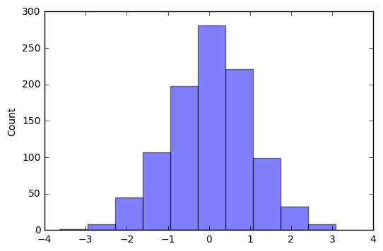
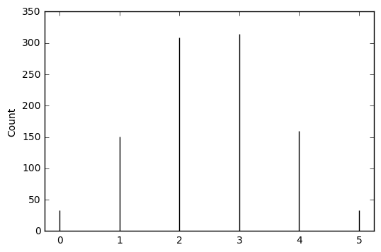
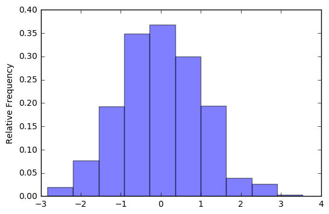
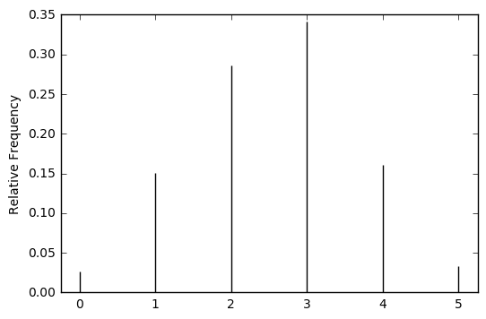
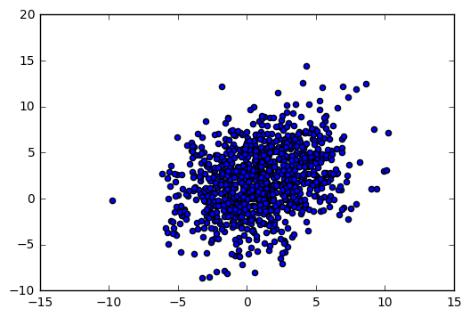

# Symbulate Documentation

*Symbulate* is a Python package which provides a user friendly framework for conducting simulations involving probability models. 

<a id='contents'></a>

1. [**Installing Symbulate:**](#install) Instructions for installing symbulate and importing it during a session.
1. [**Probability spaces:**](#prob) Methods for defining a probability space.
  1. [**BoxModel:**](#boxmodel) Define a simple box model probability space.
  1. [**Draw:**](#draw) Draw an outcome according to a probability model.
  1. [**ProbabilitySpace:**](#probability_space) Define more general probability spaces.
  1. [**Common discrete probability models:**](#discrete) Many common discrete probability models (binomial, Poisson, etc.) are available.
  1. [**Common continuous probability models:**](#continuous) Many common continuous probability models (normal, exponential, etc.) are available.
  1. [**Independent spaces:**](#indep) Combine independent probability spaces.
1. [**Simulation tools:**](#simulation)
  1. [**Simulate:**](#sim) Use **.sim()** to simulate outcomes of a probability model, or to simulate values of a random variable
  1. [**Apply:**](#apply) Use **.apply()** to apply a function to each simulated outcome or value
  1. [**Tabulate:**](#tabulate) Use **.tabulate()** to tabulate simulated outcomes of a probability model or simulated values of a random variable
  1. [**Filter:**](#filter) Create a *subset* of the values which satsify some criteria.
1. [**Random variables:**](#random_variables)
  1. [**RV:**](#rv) Use **RV()** to define a random variable on a probability space.
  1. [**Histogram:**](#hist) Use **.hist()** to display a plot summary of the simulated values of a RV.
  1. [**Mean:**](#mean) Use **.mean()** to compute the average of the simulated values of a RV.
  1. [**Variance:**](#var): Use **.var()** to compute the variance of the simulated values of a RV.
  1. [**Standard deviation:**](#var): Use **.sd()** to compute the standard deviation of the simulated values of a RV.
1. [**Multiple random variables:**](#joint) 
  1. [**Component:**](#component) Use **.component()** to refer to the individual RVs
  1. [**Scatter:**](#scatter) Use **.scatter()** to display a scatterplot summary of the simulated values of two random variables.
  1. [**Covariance:**](#cov) Use **.cov()** to compute the covariance between two random variables, or the covariance matrix for three or more random variables
  1. [**Correlation:**](#cov) Use **.cor()** to compute the correlation between two random variables, or the correlation matrix for three or more random variables


<a id='install'></a>

## Installing Symbulate

Instructions for downloading and installing Symbulate can be found [here](http://calpoly.edu/~dsun09/python.html).  Install Symbulate during a session using the following commands.


```python
from symbulate import *
%matplotlib inline
```

<a id='prob'></a>
[Back to contents](#contents)

## Probability Spaces

A probability space consists of a sample space of possible outcomes and a probability measure which specifies how to assign probabilities to related events.  Several common probability models are available in Symbulate.  Users can also define probability spaces.

<a id='boxmodel'></a>
[Back to contents](#contents)

### BoxModel

The box model representation can be used from many probability models.  Enter a list repesenting the tickets in the box.  For example, rolling a fair six-sided die could be represented as a box model with six tickets labeled 1 through 6.


```python
die = [1, 2, 3, 4, 5, 6]
roll = BoxModel(die)
```

The list of numbers could also have been created using **range()** in Python. Remember that Python indexing starts from 0 by default. Remember also that `range` gives you all the values, up to, but *not including* the last value.


```python
die = list(range(1, 6+1)) # this is just a list of the number 1 through 6
roll = BoxModel(die)
```

<a id='draw'></a>
[Back to contents](#contents)

### Draw

BoxModel itself just defines the model; it does return any values.  (The same is true for any probability space.) **.draw()** can be appended to a BoxModel (or any probability space) to simulate one draw according to the probability model.


```python
roll.draw()
```


    2


### BoxModel options
* size
* probs
* replace

Multiple tickets can be drawn from the box using the **size** argument.


```python
BoxModel(die, size = 3).draw()
```


    (5, 1, 2)


BoxModel by default assumes equally likely tickets.  This can be changed using the **probs** argument, by specifying a probability value for each ticket.

*Example.* Suppose 32% of Americans are Democrats, 27% are Republican, and 41% are Independent.  Random select 5 Americans are record their party affiliation.  This situation could be represented as sampling with replacement from a box with 100 tickets, 32 of which are Democrat, etc.  But rather than specifying a list of 100 tickets, we can just specify the three tickets and the corresponding probabilities with probs.  


```python
BoxModel(['D','R','I'], probs = [0.32, 0.27, 0.41], size = 5).draw()
```


    ('R', 'I', 'D', 'I', 'R')


BoxModel by default assumes sampling with replacement; each ticket is placed back in the box before the next ticket is selected.  Sampling *without replacement* can be handled with **replace = False**.  (The default is replace = True.)

*Example.*  Two people are selected at random from Anakin, Bella, Frodo, Harry, Katniss to go on a quest.


```python
BoxModel(['A','B','F','H','K'], size = 2, replace = False).draw()
```


    ('H', 'B')


Note that by default, BoxModel returns ordered outcomes, e.g. ('A', 'B') is distinct from ('B', 'A'). To return unordered outcomes, set `order_matters=False`.

<a id='probability_space'></a>
[Back to contents](#contents)

## ProbabilitySpace

Symbulate has many common probability models built in.  **ProbabilitySpace** allows for user defined probability models.  The first step in creating a probabiltiy space is to define function that explains how to draw one outcome. 

*Example.* Ten percent of all e-mail is spam. Thirty percent of spam e-mails contain the word "money", while 2% of non-spam e-mails contain the word "money". Suppose an e-mail contains the word "money". What is the probability that it is spam?

We can think of the sample space of outcomes of pairs of the possible email types (spam or not) and wordings (money or not), with the probability measure following the above specifications.  The function spam_sim below encodes these specifications; note the use of .draw().


```python
def spam_sim():
    email_type = BoxModel(["spam", "not spam"], probs=[.1, .9]).draw()
    if email_type == "spam":
        has_money = BoxModel(["money", "no money"], probs=[.3, .7]).draw()
    else:
        has_money = BoxModel(["money", "no money"], probs=[.02, .98]).draw()
    return email_type, has_money
```

A probability space can be created once the specifications of the simulation have been defined through a function.


```python
P = ProbabilitySpace(spam_sim)
P.draw()
```


    ('not spam', 'no money')


<a id='discrete'></a>
[Back to contents](#contents)

### Common discrete probability models

The following discrete probability spaces are included.
* Discrete uniform (see BoxModel)
* Bernoulli
* Binomial
* Hypergeometric
* Poisson
* Geometric
* Negative binomial (a.k.a. Pascal)


```python
Bernoulli(p = 0.3).draw()
```


    0


```python
Binomial(n = 10, p = .5).draw()
```


    5


```python
Hypergeometric(n = 10, N0 = 50, N1 = 50).draw()
```


    6


```python
Poisson(lam = 5).draw()
```


    1


```python
Geometric(p = 0.2).draw()
```


    6


```python
NegativeBinomial(n = 5, p = 0.2).draw()
```


    15


```python
Pascal(n = 5, p = 0.2).draw()
```


    9


### Common discrete continuous probability models

The following continuous probability spaces are included.

* Uniform
* Normal (a.k.a. Gaussian)
* Exponential
* Gamma


```python
Uniform(a = 0, b = 1).draw()
```


    0.27943974006774086


```python
Normal(mean = 0, var = 1).draw()
```


    -0.005451823152434024


Exponential and Gamma distributions can be parametrized in terms of the rate $\lambda$ (using lam=) or the scale parameter $1/\lambda$ (using scale=).


```python
Exponential(lam = 4).draw()
```


    0.1063023948559254


```python
Exponential(scale = 4).draw()
```


    1.3611084880748558


```python
Gamma(shape = 2, lam = 4).draw()
```


    0.9905358307068215


```python
Gamma(shape = 2, scale = 4).draw()
```


    13.477924140229097


<a id='indep'></a>
[Back to contents](#contents)

### Independent probability spaces

*Independent* probability spaces can be combined using an asterisk.  Multiple independent copies of a probability space can be created using exponential (double asterisk).

*Example.*  Roll a fair six-sided die and a fair four-sided die.


```python
die6 = list(range(1, 6+1, 1))
die4 = list(range(1, 4+1, 1))
rolls = BoxModel(die6)*BoxModel(die4)
rolls.draw()
```


    (6, 3)


*Example.* Four independent N(0,1) values.


```python
P = Normal(mean = 0, var =1)**4
P.draw()
```


    (-0.8342418680048226,
     1.7279106507318647,
     0.1862570399174438,
     -0.02413693935864512)


<a id='simulation'></a>
[Back to contents](#contents)

## Simulation tools

There are several tools available for simulating outcomes from a probability space and analyzing the results.  In general, the tools below can be appended onto each other, e.g. `P.sim(1000).apply(sum).tabulate()`.

<a id='sim'></a>
[Back to contents](#contents)

### Simulate

The .draw() extension simulates one draw from a probability space.  Many draws can be simulated **.sim()**.  The argument is the number of outcomes to simulate.

*Example.*  Simulate 100 repetitions of rolling two fair six-sided dice; each repetition involves a pair of values.


```python
die = list(range(1, 6+1)) # this is just a list of the number 1 through 6
roll = BoxModel(die, size = 2)
roll.sim(100)
```


    <table>
      <thead>
        <th width="10%">Index</th>
        <th width="90%">Result</th>
      </thead>
      <tbody>
        <tr><td>0</td><td>(1, 1)</td></tr><tr><td>1</td><td>(6, 6)</td></tr><tr><td>2</td><td>(5, 3)</td></tr><tr><td>3</td><td>(4, 6)</td></tr><tr><td>4</td><td>(2, 5)</td></tr><tr><td>5</td><td>(2, 4)</td></tr><tr><td>6</td><td>(3, 4)</td></tr><tr><td>7</td><td>(3, 6)</td></tr><tr><td>8</td><td>(4, 1)</td></tr><tr><td>...</td><td>...</td></tr><tr><td>99</td><td>(1, 5)</td></tr>
      </tbody>
    </table>
    


*Example.*  Ten percent of all e-mail is spam. Thirty percent of spam e-mails contain the word "money", while 2% of non-spam e-mails contain the word "money". Simulate the email status (spam or not) and wording (money or not) for 1000 emails.


```python
def spam_sim():
    email_type = BoxModel(["spam", "not spam"], probs=[.1, .9]).draw()
    if email_type == "spam":
        has_money = BoxModel(["money", "no money"], probs=[.3, .7]).draw()
    else:
        has_money = BoxModel(["money", "no money"], probs=[.02, .98]).draw()
    return email_type, has_money

P = ProbabilitySpace(spam_sim)
P.sim(1000)
```


    <table>
      <thead>
        <th width="10%">Index</th>
        <th width="90%">Result</th>
      </thead>
      <tbody>
        <tr><td>0</td><td>('not spam', 'no money')</td></tr><tr><td>1</td><td>('not spam', 'no money')</td></tr><tr><td>2</td><td>('not spam', 'no money')</td></tr><tr><td>3</td><td>('spam', 'money')</td></tr><tr><td>4</td><td>('not spam', 'no money')</td></tr><tr><td>5</td><td>('not spam', 'no money')</td></tr><tr><td>6</td><td>('not spam', 'no money')</td></tr><tr><td>7</td><td>('spam', 'money')</td></tr><tr><td>8</td><td>('not spam', 'no money')</td></tr><tr><td>...</td><td>...</td></tr><tr><td>999</td><td>('not spam', 'no money')</td></tr>
      </tbody>
    </table>
    


Note that every time .sim() is called new values are simulated.  Store simulated values as a variable in order to perform multiple operations in different lines of code on the same set of values.

<a id='apply'></a>
[Back to contents](#contents)

### Apply

Use **.apply()** to apply a function to each outcome of a simulation.

Example. Roll two fair six-sided dice and compute their sum.


```python
die = list(range(1, 6+1)) # this is just a list of the number 1 through 6
roll = BoxModel(die, size = 2)
roll.sim(100).apply(sum)
```


    <table>
      <thead>
        <th width="10%">Index</th>
        <th width="90%">Result</th>
      </thead>
      <tbody>
        <tr><td>0</td><td>7</td></tr><tr><td>1</td><td>4</td></tr><tr><td>2</td><td>5</td></tr><tr><td>3</td><td>9</td></tr><tr><td>4</td><td>4</td></tr><tr><td>5</td><td>9</td></tr><tr><td>6</td><td>2</td></tr><tr><td>7</td><td>6</td></tr><tr><td>8</td><td>7</td></tr><tr><td>...</td><td>...</td></tr><tr><td>99</td><td>7</td></tr>
      </tbody>
    </table>
    


User defined functions can also be applied.

*Example.* Ten cards labeled 1, 2, $\ldots$, 10 are shuffled and dealt one at a time.  Find the the probability that the number on the card matches its position in the deal for at least one of the cards.  (For example, a match occurs if card 3 is the third card dealt.) 


```python
n = 10
labels = list(range(n))
# remember, Python starts the index at 0, so the cards are labebeled 0, ..., 9

def is_match(x):
    count = 0
    for i in range(0, n, 1):
        if x[i] == labels[i]: count = count + 1
    if count > 0:
        return 'At least one match'
    else:
        return 'No match'

P = BoxModel(labels, size = n, replace = False)
P.sim(10000).apply(is_match)
```


    <table>
      <thead>
        <th width="10%">Index</th>
        <th width="90%">Result</th>
      </thead>
      <tbody>
        <tr><td>0</td><td>At least one match</td></tr><tr><td>1</td><td>No match</td></tr><tr><td>2</td><td>At least one match</td></tr><tr><td>3</td><td>No match</td></tr><tr><td>4</td><td>At least one match</td></tr><tr><td>5</td><td>At least one match</td></tr><tr><td>6</td><td>At least one match</td></tr><tr><td>7</td><td>At least one match</td></tr><tr><td>8</td><td>At least one match</td></tr><tr><td>...</td><td>...</td></tr><tr><td>9999</td><td>At least one match</td></tr>
      </tbody>
    </table>
    


<a id='tabulate'></a>
[Back to contents](#contents)

### Tabulate

The outcomes of a simulation can be quickly tabulated using **.tabulate()**.  Tabulate counts the number of times each outcome occurs among the simulated values.  Use **.tabulate(relfreq = True)** to find the proportion (relative frequency) of times each outcome occurs.

**Example.** Roll two fair six-sided.


```python
die = list(range(1, 6+1, 1)) # this is just a list of the number 1 through 6
roll = BoxModel(die, size = 2)
rolls = roll.sim(10000)
rolls.tabulate()
```


    <table>
      <thead>
        <th width="80%">Outcome</th>
        <th width="20%">Value</th>
      </thead>
      <tbody>
        <tr><td>(1, 1)</td><td>281</td></tr><tr><td>(1, 2)</td><td>283</td></tr><tr><td>(1, 3)</td><td>276</td></tr><tr><td>(1, 4)</td><td>276</td></tr><tr><td>(1, 5)</td><td>323</td></tr><tr><td>(1, 6)</td><td>262</td></tr><tr><td>(2, 1)</td><td>277</td></tr><tr><td>(2, 2)</td><td>286</td></tr><tr><td>(2, 3)</td><td>268</td></tr><tr><td>(2, 4)</td><td>289</td></tr><tr><td>(2, 5)</td><td>264</td></tr><tr><td>(2, 6)</td><td>294</td></tr><tr><td>(3, 1)</td><td>276</td></tr><tr><td>(3, 2)</td><td>285</td></tr><tr><td>(3, 3)</td><td>276</td></tr><tr><td>(3, 4)</td><td>323</td></tr><tr><td>(3, 5)</td><td>314</td></tr><tr><td>(3, 6)</td><td>264</td></tr><tr><td>(4, 1)</td><td>284</td></tr><tr><td>...</td><td>...</td></tr><tr><td>(6, 6)</td><td>288</td></tr><tr><td><b>Total</b></td><td><b>10000</b></td></tr>
      </tbody>
    </table>
    


Now sum the dice, and approximate the distribution of the sum using the relative frequency option.


```python
rolls.apply(sum).tabulate(relfreq = True)
```


    <table>
      <thead>
        <th width="80%">Outcome</th>
        <th width="20%">Value</th>
      </thead>
      <tbody>
        <tr><td>2</td><td>0.0281</td></tr><tr><td>3</td><td>0.056</td></tr><tr><td>4</td><td>0.0838</td></tr><tr><td>5</td><td>0.1113</td></tr><tr><td>6</td><td>0.1434</td></tr><tr><td>7</td><td>0.1665</td></tr><tr><td>8</td><td>0.1393</td></tr><tr><td>9</td><td>0.1072</td></tr><tr><td>10</td><td>0.0832</td></tr><tr><td>11</td><td>0.0524</td></tr><tr><td>12</td><td>0.0288</td></tr><tr><td><b>Total</b></td><td><b>0.9999999999999999</b></td></tr>
      </tbody>
    </table>
    


Individual entries of the table can be references using **.tabulate()[*label*]** where label represents the value of interest.


```python
rolls.tabulate()[(2,4)]
```


    289


```python
roll_sum = rolls.apply(sum).tabulate(relfreq=True)
roll_sum[11] + roll_sum[12]
```


    0.0812


<a id='filter'></a>
[Back to contents](#contents)

### Filter

You can get the subset of simulations equal to a particular value using **.filter_eq()**.


```python
Heads = BoxModel(['H','T']).sim(10000).filter_eq('H')
Heads
```


    <table>
      <thead>
        <th width="10%">Index</th>
        <th width="90%">Result</th>
      </thead>
      <tbody>
        <tr><td>0</td><td>H</td></tr><tr><td>1</td><td>H</td></tr><tr><td>2</td><td>H</td></tr><tr><td>3</td><td>H</td></tr><tr><td>4</td><td>H</td></tr><tr><td>5</td><td>H</td></tr><tr><td>6</td><td>H</td></tr><tr><td>7</td><td>H</td></tr><tr><td>8</td><td>H</td></tr><tr><td>...</td><td>...</td></tr><tr><td>5097</td><td>H</td></tr>
      </tbody>
    </table>
    


Using **len** (length) with the filter functions is one way to count the simulated occurrences of outcomes which satisfy some criteria.


```python
len(Heads)
```


    5098


In addition to **.filter_eq()**, the following filter functions can be used when the values are numerical.

* **.filter_neq()** subsets the values *not equal to* the argument
* **.filter_lt()** subsets the values *less than* the argument
* **.filter_leq()** subsets the values *less than or equal to* the argument
* **.filter_gt()** subsets the values *greater than* the argument
* **.filter_geq()** subsets the values *greater than or equal to* the argument


```python
die = list(range(1, 1+6)) # this is just a list of the number 1 through 6
sims = BoxModel(die, size = 2).sim(1000).apply(sum)
len(sims.filter_geq(10)) / 1000
```


    0.178


You can also define your own custom filter function. Define a function that returns `True` for the outcomes you want to keep, and pass the function into `.filter()`. For example, the following code is equivalent to using `.filter_geq(10)`.


```python
def greater_than_or_equal_to_10(x):
    return x >= 10

len(sims.filter(greater_than_or_equal_to_10)) / 1000
```


    0.178


<a id='random_variables'></a>
[Back to contents](#contents)

## Random variables

A random variable is a function that takes as an input an outcome of a probability space and returns a real number.  Values of a random variable can be simulated and analyzed much like the outcomes of a probability space.  However, since the values of a random variable are always numbers (while the outcomes of a probability space are not necessarily numbers) several additional tools are available.

<a id='rv'></a>
[Back to contents](#contents)

### RV

Use the RV class to define random variables on a probability space.  A random variable is a function which maps the outcomes of a probability space to a real number; therefore a probability space must be defined first.

*Example.* Consider the random variable $X$ representing the number of Heads in 5 flips of a fair coin.  With 1 representing Heads and 0 Tails, we can count the number of Heads by summing the 0/1 values.  We define a probability space corresponding to 5 flips of a fair coin, and then a RV on that space which takes an outcome and sums its values.


```python
P = BoxModel([0,1], size = 5)
X = RV(P, sum)
```

Like the probability space defintions, the RV command only defines a random variable.  The `.sim()`, `.tabulate()`, and `.filter()` functions work for `RV` just like for `ProbabilitySpace`.


```python
values = X.sim(1000)
values
```


    <table>
      <thead>
        <th width="10%">Index</th>
        <th width="90%">Result</th>
      </thead>
      <tbody>
        <tr><td>0</td><td>5</td></tr><tr><td>1</td><td>4</td></tr><tr><td>2</td><td>0</td></tr><tr><td>3</td><td>1</td></tr><tr><td>4</td><td>3</td></tr><tr><td>5</td><td>2</td></tr><tr><td>6</td><td>3</td></tr><tr><td>7</td><td>1</td></tr><tr><td>8</td><td>0</td></tr><tr><td>...</td><td>...</td></tr><tr><td>999</td><td>3</td></tr>
      </tbody>
    </table>
    


```python
values.tabulate(relfreq=True)
```


    <table>
      <thead>
        <th width="80%">Outcome</th>
        <th width="20%">Value</th>
      </thead>
      <tbody>
        <tr><td>0</td><td>0.034</td></tr><tr><td>1</td><td>0.143</td></tr><tr><td>2</td><td>0.322</td></tr><tr><td>3</td><td>0.333</td></tr><tr><td>4</td><td>0.141</td></tr><tr><td>5</td><td>0.027</td></tr><tr><td><b>Total</b></td><td><b>1.0</b></td></tr>
      </tbody>
    </table>
    


```python
len(values.filter_gt(3))/1000
```


    0.168


A random variable with a specific probability distribution can be defined by creating a probability space, P, corresponding to the distribution, and defining `X = RV(P)`. (The default mapping for RV is the identity function).

*Example.* Simulate the values of a standard normal random variable.


```python
P = Normal(mean = 0, var = 1)
X = RV(P)
X.sim(1000)
```


    <table>
      <thead>
        <th width="10%">Index</th>
        <th width="90%">Result</th>
      </thead>
      <tbody>
        <tr><td>0</td><td>1.641229234392505</td></tr><tr><td>1</td><td>-0.459125654762976</td></tr><tr><td>2</td><td>-0.13451910993829214</td></tr><tr><td>3</td><td>0.4767089028952646</td></tr><tr><td>4</td><td>-0.7043859974459955</td></tr><tr><td>5</td><td>-1.031449899454203</td></tr><tr><td>6</td><td>0.30868710375390174</td></tr><tr><td>7</td><td>-0.1727402555891247</td></tr><tr><td>8</td><td>0.06407400283928748</td></tr><tr><td>...</td><td>...</td></tr><tr><td>999</td><td>-0.19030347580045748</td></tr>
      </tbody>
    </table>
    


Random variables can also be specified by user defined functions.

Example. Ten cards labeled 1, 2, $\ldots$ , 10 are shuffled and dealt one at a time. Let $X$ be the number of the cards (out of ten) for which the number on the card matches its position in the deal. (For example, a match occurs if card 3 is the third card dealt.)


```python
n = 10
labels = list(range(n))
# remember, Python starts the index at 0, so the cards are labebeled 0, ..., 9

def number_matches(x):
    count = 0
    for i in range(0, n, 1):
        if x[i] == labels[i]: count = count + 1
    return count


P = BoxModel(labels, size = n, replace = False)
X = RV(P, number_matches)
X.sim(10000)
```


    <table>
      <thead>
        <th width="10%">Index</th>
        <th width="90%">Result</th>
      </thead>
      <tbody>
        <tr><td>0</td><td>0</td></tr><tr><td>1</td><td>0</td></tr><tr><td>2</td><td>0</td></tr><tr><td>3</td><td>2</td></tr><tr><td>4</td><td>1</td></tr><tr><td>5</td><td>1</td></tr><tr><td>6</td><td>1</td></tr><tr><td>7</td><td>0</td></tr><tr><td>8</td><td>2</td></tr><tr><td>...</td><td>...</td></tr><tr><td>9999</td><td>1</td></tr>
      </tbody>
    </table>
    


Functions of random variables are also random variables.  If X is an RV, define a new RV $Y=g(X)$ using `X.apply(g)`.  The resulting $Y$ behaves like any other RV.

Note that for many math functions such as `exp` and `log` and `sin`, you can simply call `exp(X)` instead of `X.apply(exp)`.

*Example.* If $X$ has a normal distribution, then $e^X$ has a *lognormal* distribution.


```python
P = Normal(mean = 0, var = 1)
X = RV(P)
Y = exp(X) # same as X.apply(exp)
Y.sim(1000)
```


    <table>
      <thead>
        <th width="10%">Index</th>
        <th width="90%">Result</th>
      </thead>
      <tbody>
        <tr><td>0</td><td>12.37303364664991</td></tr><tr><td>1</td><td>1.348956664478362</td></tr><tr><td>2</td><td>2.7860801574231795</td></tr><tr><td>3</td><td>1.1192127011705306</td></tr><tr><td>4</td><td>1.730586362727102</td></tr><tr><td>5</td><td>0.4431535316673459</td></tr><tr><td>6</td><td>19.028934514681804</td></tr><tr><td>7</td><td>0.39725191366025026</td></tr><tr><td>8</td><td>1.5766661760040779</td></tr><tr><td>...</td><td>...</td></tr><tr><td>999</td><td>1.0281445354952117</td></tr>
      </tbody>
    </table>
    


<a id='hist'></a>
[Back to contents](#contents)

### Histograms

Use `.hist()` to create a *histogram* which provides a plot summary of the simulated values of a RV.

*Example.* Simulate values of a standard normal random variable.


```python
RV(Normal(mean = 0, var = 1)).sim(1000).hist()
```





For a discrete random variable use **.hist(type="line")** for a "spike" plot of the simulated probabilty mass function.

*Example.* $X$ is the number of Heads in 5 flips of a fair coin:


```python
P = BoxModel([0,1], size = 5)
X = RV(P, sum)
X.sim(1000).hist(type="line")
```





Like .tabulate(), use **.hist(relfreq=True)** to get relative frequencies rather than counts.
* When type="line" the y-axis will be the *relative frequency*.
* Otherwise, the y-axis will represent *density* (for a continuous random variable).


```python
RV(Normal(mean = 0, var = 1)).sim(1000).hist(relfreq = True)
```





```python
P = BoxModel([0,1], size = 5)
X = RV(P, sum)
X.sim(1000).hist(type="line", relfreq = True)
```





<a id='mean'></a>
[Back to contents](#contents)

### Mean

The expected value of a random variable, $E(X)$, is its probability-weighted average value.  An expected value can be approximated by simulating many values of the random variable and finding their sample mean (i.e. average) using **.mean()**.

*Example*.  If $X$ has a geometric distribution with $p = 0.1$ its expected value is $1/0.1 = 10$.


```python
RV(Geometric(p = 0.1)).sim(10000).mean()
```


    9.9666999999999994


<a id='var'></a>
[Back to contents](#contents)

### Variance

The variance of a random variable is the probability-weighted average of the squared deviation from the expected value: $E[|X-E(X)|^2]$.  Similar to expected value, variance can be approximated by simulating many values of the random variable and finding their sample variance, using **.var()**

*Example.* If $X$ has an exponential distribution with rate parameter $\lambda=1/4$ its variance is 16.


```python
X = RV(Exponential(lam = 1/4))
X.sim(10000).var()
```


    15.30842079606605


**Standard deviation** is the square root of the variance.


```python
X.sim(10000).sd()
```


    3.9778039811549752


<a id='joint'></a>
[Back to contents](#contents)

## Multiple random variables

Many problems involve several random variables defined on the same probability space.  Of interest are properties of the joint distribution which describe the relationship between the random variables.  Pairs of values of two random variables, or tuples of values of multiple random variables, can be simulated simultaneously using **&**.

*Example.*  Let $X$ be the minimum and $Y$ the maximum of two independent Uniform(0,1) random variables. 


```python
P = Uniform(a = 0, b = 1)**2
X = RV(P, min)
Y = RV(P, max)
(X & Y).sim(10000)
```


    <table>
      <thead>
        <th width="10%">Index</th>
        <th width="90%">Result</th>
      </thead>
      <tbody>
        <tr><td>0</td><td>(0.46027719498519537, 0.8333366732651852)</td></tr><tr><td>1</td><td>(0.6764847185109701, 0.7453472417695879)</td></tr><tr><td>2</td><td>(0.01657809311934244, 0.33692152117988705)</td></tr><tr><td>3</td><td>(0.3530195026931301, 0.8334438207228971)</td></tr><tr><td>4</td><td>(0.26628257984508175, 0.9630668468745988)</td></tr><tr><td>5</td><td>(0.19597775040221577, 0.5660591688727603)</td></tr><tr><td>6</td><td>(0.030849492926371735, 0.7650500441472756)</td></tr><tr><td>7</td><td>(0.15994479327847977, 0.809958516350921)</td></tr><tr><td>8</td><td>(0.14261778800011826, 0.846513455140759)</td></tr><tr><td>...</td><td>...</td></tr><tr><td>9999</td><td>(0.7289132074617036, 0.9151120326838237)</td></tr>
      </tbody>
    </table>
    


When multiple random variables are simulated applying **.mean()**, **.var()**, or **.sd()** returns the marginal means, variances, and standard deviations, respectively, of each of the random variables involved.


```python
(X & Y).sim(10000).mean()
```


    (0.33421172705209135, 0.66743395563053043)


<a id='component'></a>
[Back to contents](#contents)

### Component

When several random variables are defined, each individual random variable can be referenced using **.component()**, with the argument equal to the index of the random variable of interest.  Applying .component() to a vector returns a RV, which can be treated as a single random variable as usual.

(Remember that Python starts indices at 0: 0 is the first element, 1 is the second, and so on.)

*Example.* Let $U_0$ and $U_1$ be independent Uniform(0,1) random variables.


```python
P = Uniform(a = 0, b = 1)**2
U0 = RV(P).component(0)
U1 = RV(P).component(1)
(U0 & U1).sim(10000)
```


    <table>
      <thead>
        <th width="10%">Index</th>
        <th width="90%">Result</th>
      </thead>
      <tbody>
        <tr><td>0</td><td>(0.6004899797682012, 0.5012944645314951)</td></tr><tr><td>1</td><td>(0.4555251834061682, 0.7300492651351047)</td></tr><tr><td>2</td><td>(0.2527025362807447, 0.13810740486480322)</td></tr><tr><td>3</td><td>(0.04895227488607379, 0.06873927353973397)</td></tr><tr><td>4</td><td>(0.41741450721495255, 0.8124772727093038)</td></tr><tr><td>5</td><td>(0.25642023891640475, 0.7048076313438868)</td></tr><tr><td>6</td><td>(0.39543218282129367, 0.8205028493233834)</td></tr><tr><td>7</td><td>(0.8977784489547801, 0.43832098198532954)</td></tr><tr><td>8</td><td>(0.29018374403178326, 0.20987928058373306)</td></tr><tr><td>...</td><td>...</td></tr><tr><td>9999</td><td>(0.8585472410517343, 0.756207724869175)</td></tr>
      </tbody>
    </table>
    


```python
(U0 & U1).component(0).sim(10000)
```


    <table>
      <thead>
        <th width="10%">Index</th>
        <th width="90%">Result</th>
      </thead>
      <tbody>
        <tr><td>0</td><td>0.09898017948106819</td></tr><tr><td>1</td><td>0.745504166220306</td></tr><tr><td>2</td><td>0.03869558976573273</td></tr><tr><td>3</td><td>0.7646135757113965</td></tr><tr><td>4</td><td>0.5718696231397215</td></tr><tr><td>5</td><td>0.9984724695810253</td></tr><tr><td>6</td><td>0.9645355985983803</td></tr><tr><td>7</td><td>0.7964777151477195</td></tr><tr><td>8</td><td>0.06299170194993764</td></tr><tr><td>...</td><td>...</td></tr><tr><td>9999</td><td>0.9935221074529478</td></tr>
      </tbody>
    </table>
    


```python
U0.sim(10000)
```


    <table>
      <thead>
        <th width="10%">Index</th>
        <th width="90%">Result</th>
      </thead>
      <tbody>
        <tr><td>0</td><td>0.7261020356992555</td></tr><tr><td>1</td><td>0.788512216793656</td></tr><tr><td>2</td><td>0.3369509141028809</td></tr><tr><td>3</td><td>0.08472453147068804</td></tr><tr><td>4</td><td>0.7490508418152134</td></tr><tr><td>5</td><td>0.7370049143928038</td></tr><tr><td>6</td><td>0.06906023161644004</td></tr><tr><td>7</td><td>0.8543773724539468</td></tr><tr><td>8</td><td>0.7488007089904654</td></tr><tr><td>...</td><td>...</td></tr><tr><td>9999</td><td>0.35965616383706445</td></tr>
      </tbody>
    </table>
    


*Example.* Two soccer teams score goals independently of each other, team A according to a Poisson distribution with mean 2.3 goals per goal and team B according to a Poisson distribution with mean 1.7 goals per game.  Given that 5 goals are scored in a game, what is the expected number of goals scored by team A?


```python
P = Poisson(lam = 2.3) * Poisson(lam = 1.7)
X = RV(P).component(0)
Y = RV(P).component(1)
Z = X + Y
XZ = (X & Z).sim(10000)
XZ.filter(lambda x: x[1] == 5).component(0).mean()
```


    2.8275418275418276


<a id='cov'></a>
[Back to contents](#contents)

### Covariance

The covariance between random variables $X$ and $Y$, defined as $Cov(X,Y) = E[(X-E(X))(Y-E(Y))]$, measures their degree of linear dependence.  Covariance can be approximated by simulating many pairs of values of the random variables and using **.cov()**.

*Example.*  Let $X$ be the minimum and $Y$ the maximum of two independent Uniform(0,1) random variables.  It can be shown that $Cov(X,Y) = 1/36$ (and the correlation is 1/2).


```python
P = Uniform(a = 0, b = 1)**2
X = RV(P, min)
Y = RV(P, max)
(X & Y).sim(10000).cov()
```


    0.028477564679678026


**Correlation** is a standardized measure of linear dependence which takes values in $[-1, 1]$, and can be approximated using **.corr()**.


```python
(X & Y).sim(10000).corr()
```


    0.50226835002851211


When simulating more than two random variables, applying **.cov()** returns the covariance matrix of covariances between each pair of values.  Similarly for **.corr()**.


```python
(X & Y & X+Y).sim(10000).cov()
```


    array([[ 0.05610576,  0.02785121,  0.08395698],
           [ 0.02785121,  0.05505138,  0.08290259],
           [ 0.08395698,  0.08290259,  0.16685957]])


<a id='scatter'></a>
[Back to contents](#contents)

### Scatterplot

Use **.scatter()** to display a plot summary of the simulated pairs of values of two random variables.

*Example.* The following example shows how to simulate values from a *bivariate normal distribution*.


```python
P = Normal(mean = 0, var = 1)**2
Z0 = RV(P).component(0)
Z1 = RV(P).component(1)
muX = 1; muY = 2; sigmaX = 3; sigmaY = 4; rho = 0.5
X = muX + sigmaX * Z0
Y = muY + rho**2 * sigmaY * Z0 + sqrt(1 - rho**2) * sigmaY * Z1
XY = (X & Y).sim(1000)
XY.cov()
XY.scatter()
```




